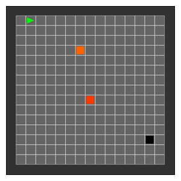

# Simple Minimalistic Gridworld Environment for OpenAI Gym (Simple-MiniGrid)

This repository is a fork from [maximecb/gym-minigrid](https://github.com/maximecb/gym-minigrid), and presents a 
simpler version of the environments with the following modifications:

- The observation is heavily simplified, becoming a 3-dimensional tuple containing the global absolute xy 
  coordinates, and the orientation/direction of the agent. The coordinates' origin is placed in the top-left corner, 
  and the orientation is encoded using 4 integers, whose mapping into orientations can be seen in the variable 
  `DIR_TO_VEC` inside `gym_simple_minigrid/minigrid.py`.

- The environments have been simplified and they do not contain interactive elements anymore. The presented 
  environments only use walls (which the agent cannot walk on), walkable areas and goals (also walkable). For this 
  reason, the set of actions has also been reduced to movements (rotate left/right and move forward). These can 
  be seen in the class 
  `SimpleMiniGridEnv.Actions` inside `gym_simple_minigrid/minigrid.py`.

- Our environments are goal-conditioned, meaning that every episode has a different random objective: a specific 
  goal position in the gridworld. As our observation does not include information about this episode goal, `env.reset()` returns the initial 
  observation/state and also the goal for the episode, which is encoded in a 2-dimensional tuple indicating the 
  global absolute xy coordinates (note that the orientation of the agent does not matter to consider a goal as 
  achived). An episode is considered achived (`done` flag) whenever the agent reaches the goal tile.
  
- Our environments support adding multiple intermediate subgoals for visualization purposes. As mentioned, our 
  implementation generates an episode goal which is used to check if the episode has been completed. Nonetheless, it 
  also has the ability of adding intermediate subgoals for curriculum learning or subgoal proposal algorithms. These 
  goals can be added using `env.add_goal(goal_pos)` and removed using `env.remove_goal()`. They are stored in a 
  stack, so last added goal is the first to be removed, although this logic could be easily modified taking a look at 
  the source code `gym_simple_minigrid/minigrid.py`. Goals at the bottom of the stack are visualized in 
  darker colors than ones at the top. Additionally, one can also modify the logic to include these intermediate 
  goals to compute the `done` flag, which by default is only set if the episode's goal (the one generated by the 
  environment) is achieved, or by time limit.
  
- Finally, there are some visual variations such as the color scheme of the rendered visualizations.
  
## Installation

Simple MiniGrid can be installed as a local package by cloning this repository and installing the dependencies with pip:

```
git clone https://github.com/rafelps/gym-simple-minigrid.git
cd gym-simple-minigrid
pip install -e .
```

## Basic Usage

From inside a Python script, the package can be used after importing it alongside gym:

```python
import gym
import gym_simple_minigrid  # just to register the envs

env = gym.make('Simple-MiniGrid-FourRooms-15x15-v0')

state, goal = env.reset()

action = ...
next_state, reward, done, info = env.step(action)
env.render()
```

Moreover, there is a UI application which allows you to manually control the agent with the arrow keys:

```
$ python manual_control.py
```

The environment being run can be selected with the `--env` option, eg:

```
$ python manual_control.py --env Simple-MiniGrid-FourRooms-15x15-v0
```


## Environments

The environments listed below are implemented in the [gym_simple_minigrid/envs](/gym_simple_minigrid/envs) directory.
Each environment provides one or more configurations registered with OpenAI Gym. Each environment
is also programmatically tunable in terms of size, complexity or time limitations.

### Empty environment

This is the simplest of our environments, formed by an outer wall and a rectangular walkable area. By default, we 
register the following size variations into OpenAI Gym.

- `'Simple-MiniGrid-Empty-5x5-v0'`
- `'Simple-MiniGrid-Empty-10x10-v0'`
- `'Simple-MiniGrid-Empty-15x15-v0'`
- `'Simple-MiniGrid-Empty-20x20-v0'`
- `'Simple-MiniGrid-Empty-25x25-v0'`

The following image shows the 15x15 version of our Empty environment. In this case, the episode's goal is visualized 
in black, while intermediate subgoals (added by the RL algorithm) are shown in a red-to-white color scale. The GIF 
shows how the agent solves some episodes (each one with a different initial state and episode goal) with the use of 
intermediate subgoals that guide the solving (all part of a RL algorithm).

<p align="center">
  
  &emsp;&emsp;&emsp;&emsp;&emsp;
  
</p>

### Four Rooms environment

This environment is called Four Rooms for obvious reasons. The walkable space is divided into four areas that are 
connected by a tiny gap: the doors. These doors are only one tile width, so this environment is extremely difficult 
for RL algorithms due to exploration difficulties (it is hard to randomly learn to change rooms).

By default, the following size variations are registered.

- `'Simple-MiniGrid-FourRooms-5x5-v0'`
- `'Simple-MiniGrid-FourRooms-10x10-v0'`
- `'Simple-MiniGrid-FourRooms-15x15-v0'`
- `'Simple-MiniGrid-FourRooms-20x20-v0'`
- `'Simple-MiniGrid-FourRooms-25x25-v0'`

The following image and GIF shows the 15x15 version of our Four Rooms environment and a successful agent solving 
several random initializations.

<p align="center">
  
  &emsp;&emsp;&emsp;&emsp;&emsp;
  
</p>
